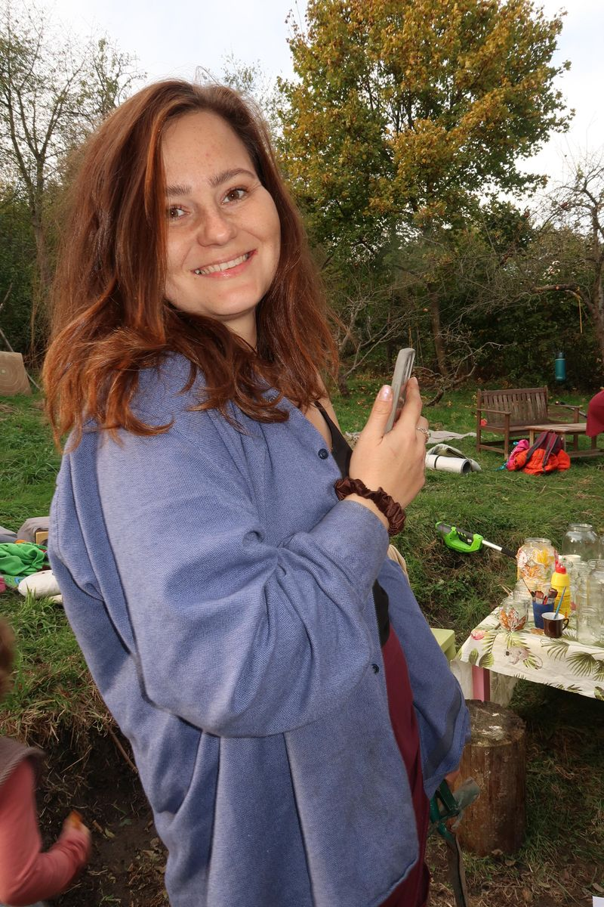
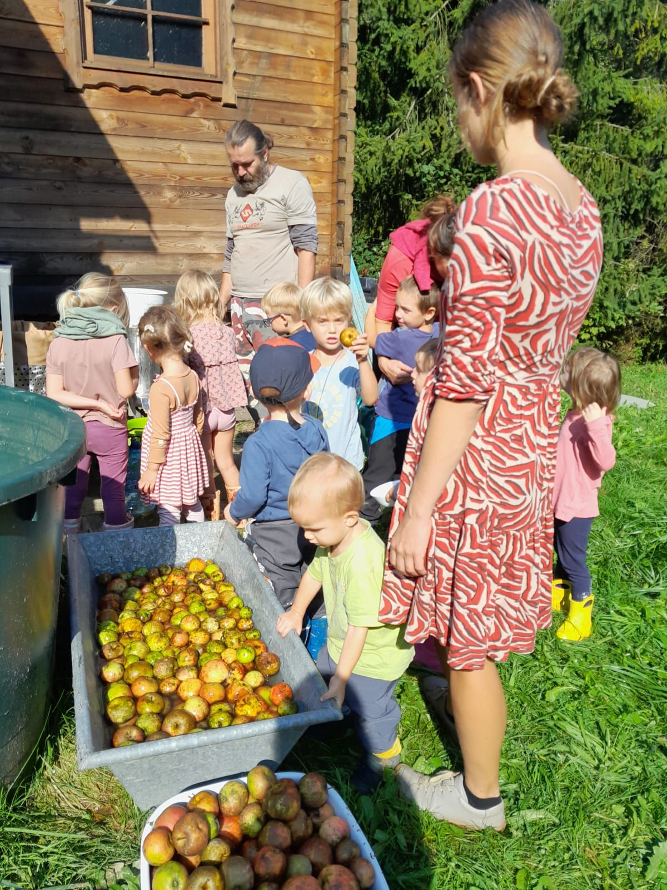

# Image Optimization Guide - Vlčí máky Website

## 📊 Recommended Image Sizes by Category

### 1. **Hero Images** (Full-width backgrounds)
**Files:** `bg-masthead.jpeg`, `bg-masthead_1.jpeg`, `14.jpg`

**Generate these sizes:**
- **1920w** (1920×1080px) - Large desktops, retina displays
- **1200w** (1200×675px) - Standard desktops
- **768w** (768×432px) - Tablets
- **480w** (480×270px) - Mobile phones

**Format:** WebP (primary) + JPG (fallback)
**Quality:** 85% for WebP, 80% for JPG

---

### 2. **Content Images** (50/50 split, max 75% width)
**Files:** 
- Team: `marketa.jpg`, `julie.jpeg`, `martin_0.jpg`, `janka.jpg`
- Equipment: `12.jpg`
- Program: `5.jpg`
- Downloads: `12.jpg`
- Zázemí carousel: `13.jpg`, `13(1).jpg`, `13(2).jpg`

**Generate these sizes:**
- **800w** (800×600px) - Desktop (col-md-6 = ~50% of 1200px)
- **600w** (600×450px) - Tablets
- **400w** (400×300px) - Mobile phones

**Format:** WebP (primary) + JPG (fallback)
**Quality:** 85% for WebP, 80% for JPG
**Aspect Ratio:** Maintain original (usually 4:3 or 3:2)

---

### 3. **Gallery Images** (3-column grid, full width)
**Files:**
- Community: `mostovani.jpg`, `komunita_2.jpeg`, `komunita_3.jpg`
- Team: `tym_0.jpg`, `tym_4.jpg`, `tym_2.jpg`
- Education: `vzdelani_0.jpg`, `vzdelani_3.jpg`, `vzdelani_2.jpg`
- Equipment: `vybaveni_2.jpg`, `vybaveni_0.jpg`, `vybaveni_1.jpg`

**Generate these sizes:**
- **1200w** (1200×800px) - Desktop (col-lg-4 = ~33% of 1200px)
- **800w** (800×533px) - Tablets (col-md-6 = ~50%)
- **600w** (600×400px) - Small tablets
- **400w** (400×267px) - Mobile phones

**Format:** WebP (primary) + JPG (fallback)
**Quality:** 85% for WebP, 80% for JPG

---

### 4. **Portfolio Carousel** (Centered, partial visibility)
**Files:** `1.jpg` through `8.jpg` (in portfolio folder)

**Generate these sizes:**
- **1200w** (1200×800px) - Desktop (centered, partially visible sides)
- **800w** (800×533px) - Tablets
- **600w** (600×400px) - Mobile phones

**Format:** WebP (primary) + JPG (fallback)
**Quality:** 85% for WebP, 80% for JPG

---

### 5. **Map Image**
**File:** `mapa-google.jpg`

**Generate these sizes:**
- **1200w** (1200×600px) - Desktop
- **800w** (800×400px) - Tablets
- **600w** (600×300px) - Mobile phones

**Format:** WebP (primary) + JPG (fallback)
**Quality:** 85% for WebP, 80% for JPG

---

## 🛠️ How to Generate Images

### Option 1: Using ImageMagick (Command Line)
```bash
# Install ImageMagick first
# For each image, generate WebP and JPG versions

# Example for hero image
convert bg-masthead.jpeg -resize 1920x1080^ -gravity center -extent 1920x1080 -quality 85 bg-masthead-1920w.webp
convert bg-masthead.jpeg -resize 1920x1080^ -gravity center -extent 1920x1080 -quality 80 bg-masthead-1920w.jpg

# Repeat for all sizes: 1200w, 768w, 480w
```

### Option 2: Using Online Tools
- **Squoosh** (https://squoosh.app/) - Google's free tool
- **Cloudinary** - Free tier available
- **TinyPNG** - WebP conversion

### Option 3: Using Photoshop/Batch Processing
1. Create action for each size
2. Export as WebP (85% quality) and JPG (80% quality)
3. Use naming: `filename-800w.webp`, `filename-800w.jpg`

---

## 📁 Recommended Folder Structure

```
assets/img/
├── hero/
│   ├── bg-masthead-1920w.webp
│   ├── bg-masthead-1920w.jpg
│   ├── bg-masthead-1200w.webp
│   ├── bg-masthead-1200w.jpg
│   └── ... (other sizes)
├── content/
│   ├── marketa-800w.webp
│   ├── marketa-800w.jpg
│   └── ... (other sizes)
├── gallery/
│   ├── mostovani-1200w.webp
│   ├── mostovani-1200w.jpg
│   └── ... (other sizes)
└── portfolio/
    ├── 1-1200w.webp
    ├── 1-1200w.jpg
    └── ... (other sizes)
```

**OR keep same structure, just add size suffix:**
```
assets/img/
├── bg-masthead-1920w.webp
├── bg-masthead-1920w.jpg
├── bg-masthead-1200w.webp
├── bg-masthead-1200w.jpg
├── marketa-800w.webp
├── marketa-800w.jpg
└── ...
```

---

## 💻 Implementation in HTML

### Example 1: Hero Image (Background)
```html
<!-- For CSS background images, use media queries in CSS -->
<style>
.masthead {
  background-image: url('assets/img/bg-masthead-480w.webp');
}

@media (min-width: 768px) {
  .masthead {
    background-image: url('assets/img/bg-masthead-768w.webp');
  }
}

@media (min-width: 1200px) {
  .masthead {
    background-image: url('assets/img/bg-masthead-1200w.webp');
  }
}

@media (min-width: 1920px) {
  .masthead {
    background-image: url('assets/img/bg-masthead-1920w.webp');
  }
}
</style>
```

### Example 2: Content Image (50/50 split)
```html
<picture>
  <source 
    srcset="assets/img/marketa-400w.webp 400w,
            assets/img/marketa-600w.webp 600w,
            assets/img/marketa-800w.webp 800w"
    sizes="(max-width: 576px) 100vw,
           (max-width: 992px) 50vw,
           400px"
    type="image/webp">
  <source 
    srcset="assets/img/marketa-400w.jpg 400w,
            assets/img/marketa-600w.jpg 600w,
            assets/img/marketa-800w.jpg 800w"
    sizes="(max-width: 576px) 100vw,
           (max-width: 992px) 50vw,
           400px"
    type="image/jpeg">
  
</picture>
```

### Example 3: Gallery Image (3-column grid)
```html
<picture>
  <source 
    srcset="assets/img/mostovani-400w.webp 400w,
            assets/img/mostovani-600w.webp 600w,
            assets/img/mostovani-800w.webp 800w,
            assets/img/mostovani-1200w.webp 1200w"
    sizes="(max-width: 576px) 100vw,
           (max-width: 768px) 50vw,
           (max-width: 992px) 50vw,
           400px"
    type="image/webp">
  <source 
    srcset="assets/img/mostovani-400w.jpg 400w,
            assets/img/mostovani-600w.jpg 600w,
            assets/img/mostovani-800w.jpg 800w,
            assets/img/mostovani-1200w.jpg 1200w"
    sizes="(max-width: 576px) 100vw,
           (max-width: 768px) 50vw,
           (max-width: 992px) 50vw,
           400px"
    type="image/jpeg">
  
</picture>
```

---

## 📋 Priority List (Start with these)

### High Priority (Largest files, most visible):
1. ✅ Hero images (`bg-masthead.jpeg`, `14.jpg`)
2. ✅ Team member photos (`marketa.jpg`, `julie.jpeg`, `martin_0.jpg`, `janka.jpg`)
3. ✅ Content images (`12.jpg`, `5.jpg`, `13.jpg` series)

### Medium Priority:
4. ✅ Gallery images (community, team, education, equipment)
5. ✅ Portfolio carousel images

### Low Priority:
6. ✅ Map image (usually small already)

---

## 🎯 Expected Performance Gains

- **File size reduction:** 60-80% (WebP vs JPG)
- **Page load time:** 30-50% faster on mobile
- **Lighthouse score:** +10-15 points for Performance
- **Core Web Vitals:** Better LCP (Largest Contentful Paint)

---

## ✅ Next Steps

1. **Generate images** using recommended sizes above
2. **Update HTML** with `<picture>` elements (I can help with this)
3. **Test** on different devices and network speeds
4. **Monitor** using Google PageSpeed Insights

---

## 📝 Notes

- Always maintain **aspect ratio** when resizing
- Use **progressive JPG** for better perceived performance
- **WebP** is supported by 95%+ of browsers (Safari 14+, Chrome, Firefox, Edge)
- Keep **original high-res** files for future use
- Consider **AVIF** format in future (even better compression than WebP)

